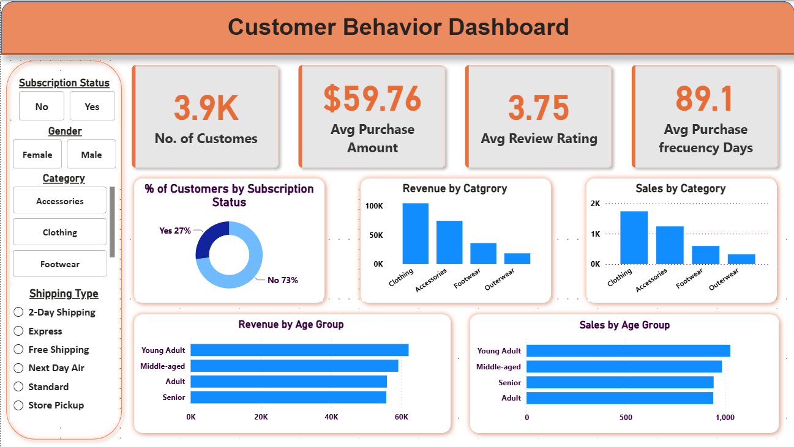

# 🛍️ Customer Shopping Behavior Analysis

<p align="center">


</p>

---

# 📌 Project Overview

This project demonstrates an **end-to-end Data Analytics workflow** for analyzing customer shopping behavior. The project covers the complete analytics pipeline from raw customer transaction data to interactive business dashboards.

The objective is to discover customer purchasing patterns, identify high-value customer segments, analyze product performance, evaluate discount effectiveness, and generate actionable business insights using **Python, PostgreSQL, SQL, and Power BI**.

---

# 🎯 Business Problem

Retail businesses generate thousands of customer transactions every day.

However, raw transaction data alone cannot answer questions like:

- Which customer segments generate the highest revenue?
- Which product categories perform the best?
- Are discounts actually increasing sales?
- Which shipping method is most profitable?
- How frequently do customers purchase?
- Which age group contributes the most revenue?

This project transforms raw customer data into meaningful business insights.

---

# 🛠️ Tech Stack

| Tool | Purpose |
|------|----------|
| Python | Data Cleaning & Feature Engineering |
| Pandas | Data Manipulation |
| PostgreSQL | Database Management |
| SQL | Business Analysis |
| Power BI | Dashboard Development |
| Git & GitHub | Version Control |

---

# 📂 Project Structure

```
Customer-Shopping-Behavior-Analysis
│
├── Data
│   └── customer_shopping_behavior.csv
│
├── Notebook
│   └── Customer_Shopping_Behavior_Analysis.ipynb
│
├── SQL
│   └── customer_behavior_analysis_queries.sql
│
├── PowerBI
│   ├── Customer_Behavior_Dashboard.pbix
│   └── Customer_Behavior_Dashboard.png
│
├── Reports
│   ├── Business Problem Statement.pdf
│   ├── Project_Report.pdf
│   └── Project_PPT.pdf
│
├── Images
│   ├── dashboard_preview.png
│   └── workflow_diagram.png
│
└── README.md
```

---

# 🔄 Complete Workflow

<p align="center">


</p>

---

# 🧹 Data Cleaning & Feature Engineering

The dataset was cleaned and transformed using **Python (Pandas)**.

### Cleaning Performed

- Removed duplicate records
- Renamed columns into snake_case
- Corrected data types
- Handled missing values
- Removed unnecessary columns

### Features Created

- Age Group
- Purchase Frequency (Days)
- Customer Segmentation Columns

---

# 🗄️ SQL Business Analysis

The cleaned dataset was imported into PostgreSQL for business analysis.

Several SQL queries were written to answer important business questions.

### SQL Analysis Includes

- Revenue by Gender
- Revenue by Age Group
- Revenue by Category
- Customer Segmentation
- Shipping Analysis
- Discount Analysis
- Repeat Customer Analysis
- Subscriber Analysis
- Product Performance
- Top Rated Products

---

# 📊 Power BI Dashboard

The dashboard provides an interactive overview of customer shopping behavior.

### Dashboard Features

- KPI Cards
- Revenue Analysis
- Customer Analysis
- Category Performance
- Subscription Analysis
- Shipping Analysis
- Interactive Filters
- Dynamic Visualizations

---

# 📸 Dashboard Preview

<p align="center">



</p>

---

# 📈 Key Business Insights

- Clothing category generated the highest revenue.
- Non-subscribers represent the majority of customers.
- Young Adults contribute the largest share of sales.
- Customers with higher review ratings tend to spend more.
- Discount strategies significantly impact purchasing behavior.
- Shipping preferences influence customer purchasing patterns.

---

# 🚀 Future Improvements

- Customer Lifetime Value (CLV) Analysis
- RFM Segmentation
- Predictive Sales Forecasting
- Machine Learning Recommendation System
- Power BI Service Deployment
- Real-time Dashboard Integration

---

# 📄 Reports Included

✔ Business Problem Statement

✔ Project Report

✔ Project Presentation

---

# 👨‍💻 Author

**Divyanshu Gautam**

GitHub:
https://github.com/DivyanshuGautam91

LinkedIn:
(https://www.linkedin.com/in/divyanshu-gautam-a48844298/)

---

⭐ If you found this project useful, don't forget to Star this repository.
